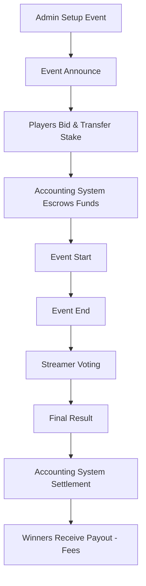

# Product Requirements Document (PRD)
**Project:** Bull PVP Competition Platform  
**Version:** 1.4 (Final with Payment Flow)  
**Date:** 2025-08-22  

---

## 1. Overview  
The Bull PVP Platform is a web/mobile application where players can compete in skill-based battles by placing monetary bids. Winners receive the pooled stakes, minus a platform fee. Results are verified through a **trusted panel of streamers/referees** who vote on the outcome.  

---

## 2. Goals & Objectives  
- Enable **secure player-vs-player (PvP) or team competitions** with real stakes.  
- Provide a **transparent result verification process** via streamer voting.  
- Ensure **fair accounting** through a centralized system that handles escrow, payouts, and fee deductions.  
- Build **trust & compliance** with transparent logs, audits, and KYC/AML features.  

---

## 3. Key Features  

### 3.1 Event Management (Admin)  
- Admins can **create and announce events**.  
- Define:  
  - Game/competition type  
  - Entry stake  
  - Event date/time  
  - Assigned streamers (referees) for result verification  

### 3.2 User Flow  
1. **Login/Register** (with KYC tiers if required).  
2. **View Event Announcements** (upcoming and ongoing).  
3. **Join/Match Bidding**:  
   - Select event  
   - Confirm stake amount  
   - Transfer stake → Accounting System  
4. **Event Start**: gameplay/competition begins.  
5. **Event End**: referees vote on result.  
6. **Final Result** announced based on majority vote.  
7. **Settlement**: Accounting System transfers winnings (minus fees).  

### 3.3 Match Bidding & Escrow  
- Stakes are locked in **Accounting System** once user joins.  
- Funds are non-withdrawable until match result is finalized.  
- Auto-refund if event cancelled/no-show.  

### 3.4 Result Verification (Streamer Voting)  
- At event end, **assigned streamers vote on the result**.  
- Majority vote decides the **final result**.  
- Tie/malicious voting → escalates to **admin override**.  
- All votes are recorded for **audit and transparency**.  

### 3.5 Settlement & Accounting System  
- **Accounting System** is the core money hub:  
  - Holds escrowed stakes  
  - Deducts platform fees  
  - Pays winners automatically  
  - Refunds where applicable  
  - Keeps immutable transaction logs  

### 3.6 Fees  
- Configurable platform fee (%) deducted from prize pool.  
- Example: $10 + $10 stakes → $20 pool → 7% fee → winner receives $18.60.  
- Fee structure can vary by stake size or membership tier.  

### 3.7 Security & Fairness  
- Voting by **trusted streamers** with reputation scores.  
- Anti-collusion detection (streamers cannot vote in events where conflict of interest exists).  
- Players limited by KYC tiers for higher stakes.  
- Immutable audit logs for all votes and transactions.  

---

## 4. User Roles  

### 4.1 Users (Players)  
- Join events, place stakes, compete.  
- View history of matches and payouts.  

### 4.2 Admins  
- Set up events, assign referees, manage disputes.  
- Override results in exceptional cases.  

### 4.3 Streamers (Referees)  
- Observe gameplay.  
- Vote on match outcomes.  
- Gain reputation through fair voting history.  

---

## 5. Event Lifecycle (Mermaid)  



---

## 6. Event Flow (ASCII Diagrams)  

### 6.1 Happy Path (Sequence)

```
Actors:  Player A       Player B        Platform        Accounting System   Streamers
---------------------------------------------------------------------------------------
            |               |               |                 |               |
[Login] ----+-------------->|               |                 |               |
            |               |<-- Event Announce --------------|               |
            |               |               |                 |               |
[Join]      |-------------->|               |-- hold stake -->|               |
            |               |<-- hold ok ---|                 |               |
            |               |               |                 |               |
            |               |               |---- Escrow OK --|               |
            |               |               |                 |               |
            |               |               |-- Event Start ----------------->|
            |               |               |                 |               |
            |<====================== PLAY MATCH =============================>|
            |               |               |<-- Event End ------------------>|
            |               |               |                 |<-- vote ----->|
            |               |               |                 |<-- vote ----->|
            |               |               |                 |<-- vote ----->|
            |               |               |                 |--> Final Result
            |               |               |-- Payout -------|               |
            |<-- Winner $$$ |               |                 |               |
```

---

### 6.2 Match State Machine

```
[CREATED]
    |
    v
[WAITING_FOR_PLAYERS] --(timeout)--> [CANCELLED]
    | (players + stakes locked)
    v
[READY]
    |
    v
[LIVE]
    |
    v
[EVENT_END]
    |
    v
[STREAMER_VOTING]
    |   \
    |    \ (tie / dispute) --> [ADMIN_REVIEW]
    v
[FINAL_RESULT]
    |
    v
[SETTLEMENT]
    |
    v
[CLOSED]
```

---

### 6.3 Voting & Result Flow

```
(Event End) --> Streamers Panel
    |
    |-- Streamer 1: Vote A
    |-- Streamer 2: Vote A
    |-- Streamer 3: Vote B
    |
    +--> Majority = A Wins
          |
          v
      Final Result --> Accounting Settlement
```

---

### 6.4 Money Movement

```
User A wallet      User B wallet        Accounting System        Platform (Fee)
     |                   |                      |                         |
     |-- Stake $S_A ---->|                      | +S_A                     |
     |                   |-- Stake $S_B ------->| +S_B                     |
     |                   |                      |                         |
     |                   |                      |-- Capture pool ----------> Fee %
     |                   |                      |                         |
     |<-- Winner Payout -|                      | - pool + payout          |
```

---

## 7. System Architecture (High Level)  

- **Frontend (Web & Mobile App):**  
  Login, event discovery, bidding, live status, result display.  

- **Backend Services:**  
  - **Authentication & KYC**  
  - **Event Service** (setup, announce, lifecycle)  
  - **Voting Service** (streamer voting, majority logic, admin override)  
  - **Accounting System** (wallets, escrow, payouts, transaction ledger)  
  - **Notification Service** (push/email)  

- **Database:**  
  - Users, Wallets, Events, Votes, Transactions, Audit Logs.  

- **Security:**  
  - Escrow funds in PCI-compliant service  
  - KYC/AML providers for identity checks  
  - Role-based access control (Admin/Streamer/User)  

---

## 8. Key Tables (Minimal Schema)  

- `users(id, name, email, role[user|admin|streamer], kyc_tier, created_at)`  
- `wallets(id, user_id, balance, currency)`  
- `events(id, name, stake_amount, status, created_at)`  
- `event_participants(event_id, user_id, stake, status[active|cancelled|won|lost])`  
- `votes(id, event_id, streamer_id, result, created_at)`  
- `transactions(id, wallet_id, type[hold|capture|payout|fee|refund], amount, created_at)`  
- `audit_logs(id, action, actor, target, meta, created_at)`  

---

## 9. Compliance & Risk  
- **Skill-based classification** to avoid gambling restrictions.  
- **KYC tiers**:  
  - Tier 0: email only, low stake cap  
  - Tier 1: phone verified, medium cap  
  - Tier 2: ID verified, high stakes  
- **Geo-blocking** for restricted jurisdictions.  
- **Responsible play features** (deposit caps, cooling-off).  

---

## 10. Success Metrics  
- # of users joining events  
- Total stake volume processed  
- Average dispute resolution time  
- Accuracy & fairness of streamer votes (no >5% overturned)  
- Retention & repeat participation  

---

## 11. Finalized Decisions  

- **How many streamers per event?**  
  Minimum of **3 streamers** must be assigned to each event (odd number recommended to avoid ties).  

- **Should streamers be paid per vote (incentive system)?**  
  ✅ Yes. Streamers will receive **a fixed incentive per valid vote**. Voting records will be tracked to ensure fairness.  

- **Should players have a replay/evidence upload option for disputes?**  
  ✅ Yes. Dispute resolution will use **streamer records (video/screenshots)** as official evidence. Players cannot directly upload, but admins may request streamer files for review.  

- **Should votes be public (transparency) or anonymous (reduce pressure)?**  
  ✅ Votes will be **anonymous**. Each vote will be linked to a **hashed streamer ID**, preventing pressure or retaliation.  
  - Streamers with consistent unfair voting will have **accounts flagged, unpaid, or disabled** after review.  
  - Aggregate results (e.g., 2–1, 3–2) will be shown publicly to maintain trust.  

---

## 12. Payment Flow Breakdown  

### 12.1 Stake Pool Distribution (Example: $10 + $10)  
- **Total Pool:** $20  
- **Platform Fee (7%):** $1.40  
- **Net Pool:** $18.60  
- **Winner Payout:** $18.60 → credited to winner’s wallet  

### 12.2 Streamer Incentives  
- Each streamer receives a **fixed per-vote fee** (e.g., $0.20 per valid vote).  
- Paid from **platform fee revenue**, not from the player prize pool.  
- If streamers are inactive, unfair, or flagged → **vote unpaid**.  

**Example Calculation (5 Streamers Voting):**  
- Streamer Incentive: $0.20 × 5 = $1.00  
- Platform Fee = $1.40  
- Net Platform Revenue = $0.40 (after paying streamers)  

### 12.3 Payment Timeline  
- **Players’ stakes:** Locked at event join, held in escrow.  
- **Streamers:** Paid after results confirmed (within 24h).  
- **Winner(s):** Payout instantly upon final result.  
- **Platform:** Collects net revenue after covering streamer incentives.  

### 12.4 Payment Security  
- All payments run through **Accounting System** ledger.  
- Immutable logs:  
  - Player deposits  
  - Streamer incentive payouts  
  - Winner payouts  
  - Platform revenue  
